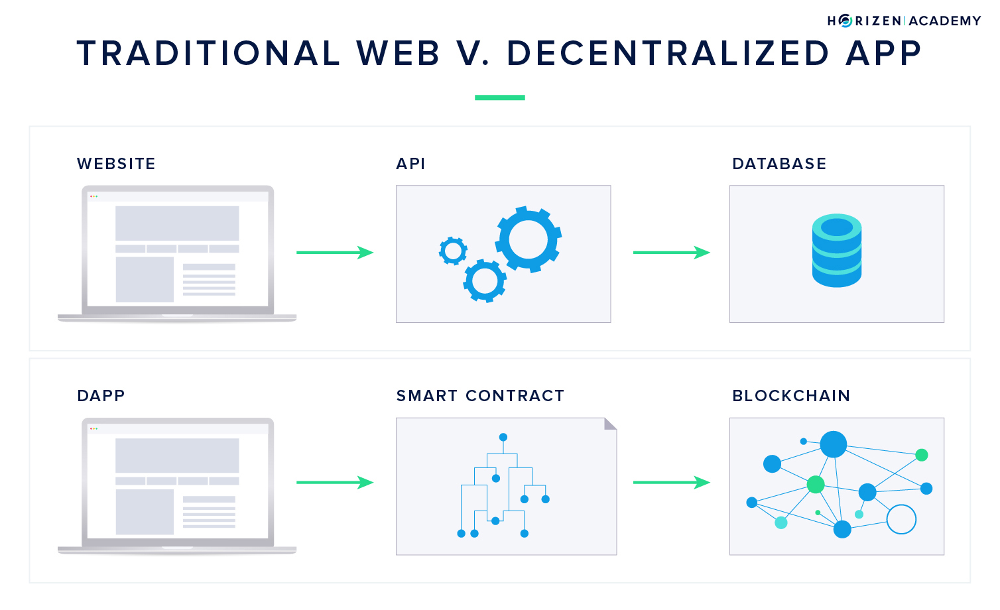
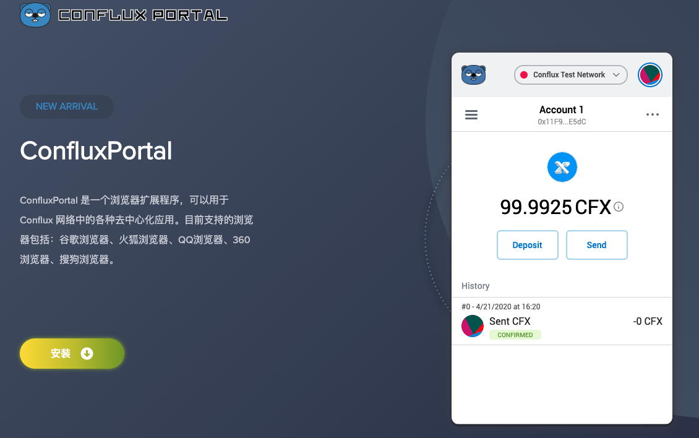
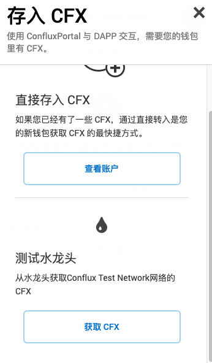

cfxtruffle 使用完全指南
===
Truffle 是以太坊生态著名的智能合约开发工具，提供编译，链接，测试，部署等实用功能，为广大 Solidity 开发者所喜爱。
Conflux 作为新一代高性能公链，不仅在完全去中心化的前提下实现了两个量级的性能提升，还实现了跟 EVM 兼容的虚拟机，
意味着 Dapp 开发者不用学习新开发语言即可以在 Conflux 网络上开发应用。
为了提升 Conflux 的合约开发体验，官方最近也对 Truffle 进行了迁移改造，打造了 [Conflux-Truffle](https://www.npmjs.com/package/conflux-truffle)，使之能够支持 Conflux 的合约开发。
本文会详细介绍如何使用 Conflux Truffle 开发 Conflux 智能合约，从环境搭建，创建项目，开发，编译，测试，部署，一一介绍。

1. 基本概念介绍
2. Dependencies 准备
3. 使用 cfxtruffle 开发智能合约
4. 参考文档


## 基本概念介绍
区块链世界是去中心化的，所有参与的节点具有相同的数据，人人平等。而数据在区块链上的组织形式是：首先多笔交易被一块打包形成一个区块(block)，
然后区块之间根据先后顺序链接起来，形成一条链，因此叫区块链(blockchain)。最初的区块链（bitcoin chain）只支持转账，因此只有一个应用（bitcoin）。
以太坊开创性的添加了 EVM 的功能，具备了图灵完整性，因此在其上可以自由开发各种去中心化应用（Dapp）。

### Epoch & storageLimit
传统的区块链账本是一条单链，从前往后每个区块都有一个编号，叫做区块号（ block number），conflux 开发了一种全新的账本结构: 树图，实现了高吞吐，低延迟。


在树图账本结构中，如果只看父边他是一个 Tree，如果父边引用边都看则是一个 Graph。正是这种结构使得 conflux 网络可以并发出块，即多个区块可以
都在某个区块之后生成。因此在 Conflux 是没有 block number 的概念。
但为了实现全序，Conflux 通过 GHAST 规则从创世区块开始，在其所有子区块中选择最重子树 block 为 pivot block，所有的 pivot block 链到一块也形成一条链
定义为 pivot chain，如果只看 pivot chain 其跟普通的区块链结构一致，在这条链上基于每个 pivot block 定义一个Epoch，因此你可以把 conflux 中的
Epoch 理解为跟 block number 对应的概念，只不过 conflux 中的每个 epoch 中可能会有多个 block。

在现实世界中，发送转账交易需要给银行付手续费，在比特币中发送交易需要给矿工付手续费，在以太坊中同样如此。具体来讲，以太坊网络的交易最终是由矿工
运行的 EVM 执行的，gas 是用来衡量一笔交易执行的工作量（可以理解为工作的工时），交易发送者，发送交易时可以指定愿意给每个工作量付的价格即 gasPrice。
因此最终一笔交易的手续费为 gas * gasPrice。
在发送一笔交易时指定的 gas 则是一个限制值，即发送方最大愿意为一笔交易支付 gas 这么多的工时，如果交易需要的工作量超过 gas，则不会再付钱，交易不会被执行。

在 Dapp 系统中，交易执行除了需要矿工进行计算付出计算资源外，还需要矿工存储合约的状态，因此需要付出存储资源。在 Conflux 系统中发送交易时，还需要为状态存储
抵押一部分费用，因此在 conflux 中发送交易时会比以太坊多一个 storageLimit 参数，用于设置愿意为某笔交易存储所抵押的费用上限。在合约释放掉使用的存储空间之后，抵押的费用
也会得到返还。

### Dapp
传统 App 的所有状态都存储于中心化服务器的数据库上，其状态的查询和修改，直接通过 API 到数据库中执行 SQL 操作即可，虽然速度快，但有数据随便篡改，隐私泄露等问题。
Dapp 是运行于区块链系统之上的应用，被称为去中心化应用。应用状态存储于区块链系统之上，状态查询需要通过网络，状态更改只能通过发送交易的形式



### Wallet
在传统互联网应用中，是通过账号访问服务的，但数据本质存储于服务提供商的服务器上。在区块链世界中一切的交易发送都需要通过钱包来实现，比如以太坊的 MetaMask，Conflux 的 Portal。
在钱包中你可以查看余额，发送交易，与 Dapp 交互，领取测试网代币等。
其实本质的是，钱包中存有你账户的私钥，在区块链世界中只有私钥可以签名发送交易。
私钥只应该被你自己所保有，不能被别人知道。


## Dependencies 准备
在进行智能合约开发前，需要先准备一些开发环境.

### NPM
npm 是 node.js 的包管理工具，因为 cfxtruffle 是使用 node 开发，所以需要使用 npm 安装。
npm 包含在 node 的安装包中，只要 node 安装成功，npm 也就安装成功了。
安装 node 可以直接下载[官方](https://nodejs.org/en/)的安装包，或者使用 [nvm](https://github.com/nvm-sh/nvm)，
安装好之后，可以使用如下命令查看版本：

```sh
$ node -v
$ npm -v
```

### cfxtruffle
npm 安装成功之后，就能安装 cfxtruffle 了。
```sh
$ npm install -g conflux-truffle
# 安装完成之后, 可使用如下命令测试
$ cfxtruffle -v
```

有两点需要注意的地方：
1. npm install 的时候需要通过 -g 指定全局安装
2. npm install 包的名字为 `conflux-truffle`, 安装后的命令行程序为 `cfxtruffle`

### conflux-rust docker
开发合约调试需要运行本地节点，运行 conflux 最简单的方法是使用 docker 运行 [conflux-rust](https://hub.docker.com/repository/docker/confluxchain/conflux-rust) 镜像，此方式不需要自己编译程序，准备配置文件。只需要本地安装有 docker 环境即可。

```sh
# 下载 conflux-rust docker 镜像
$ docker pull confluxchain/conflux-rust
# 启动节点
$ docker run -p 12537:12537 --name cfx-node confluxchain/conflux-rust
```
简单一个命令即启动了一个本地 Conflux 节点，并且该节点会同时创建 10 个本地账号，每个账号分配 1000 CFX 用于合约部署和交互，且这些账号会自动 unlock。
conflux-rust 镜像启动之后，cfxtruffle 可以直接使用它来部署合约，以及同合约交互。

当然也可以自己编译或下载节点程序，自定义配置文件，然后运行本地节点，具体可参看[这篇介绍](https://github.com/Pana/conflux-101/blob/master/docs/how-to-run-a-local-independent-node.md)。
当然节点运行起来之后需要手动创建本地账号，并转账给他们使之有余额，以及手动进行解锁。

说明：
1. 本地账号可以使用节点命令行（conflux account new）或 local rpc 创建，本地账号可以被节点程序访问，并直接用于交易签名。
2. 本地账号可以直接通过 `cfx_sendTransaction` 发送交易，交易的签名操作由节点完成，不需要事先签名，本地开发 Dapp 非常方便。
3. 本地账号为了安全，需要解锁才能直接发送交易，可以在调用 `cfx_sendTransaction` 时通过第二个参数传递密码， 也可以事先调用 unlock rpc 解锁账号。
4. 目前的 cfxtruffle 需要 0.6.0 以上版本的 conflux-rust 镜像搭配使用。

### conflux portal
[Conflux portal](https://portal.conflux-chain.org/) 是一款浏览器插件钱包，支持 Chrome 和 Firefox 等浏览器。在官网点击链接即可下载安装（可能需要翻墙）。



安装后该钱包可切换不同 conflux 网络， 当然也可以连接本地网络，并且可以申领测试网络代币，如果合约本地测试完之后，可部署到测试网络测试。

## 使用 cfxtruffle 开发智能合约
环境准备好之后，可以使用 cfxtruffle 开发智能合约了，我们会使用 cfxtruffle 开发一个具有铸币和转账功能的 coin 合约。

首先来看下 cfxtruffle 所有命令:
```sh
$ cfxtruffle -h
Usage: cfxtruffle <command> [options]

Commands:
  compile   Compile contract source files
  config    Set user-level configuration options
  console   Run a console with contract abstractions and commands available
  create    Helper to create new contracts, migrations and tests
  debug     Interactively debug any transaction on the blockchain
  deploy    (alias for migrate)
  exec      Execute a JS module within this Conflux-Truffle environment
  help      List all commands or provide information about a specific command
  init      Initialize new and empty Conflux project
  install   Install a package from the Conflux Package Registry
  migrate   Run migrations to deploy contracts
  networks  Show addresses for deployed contracts on each network
  obtain    Fetch and cache a specified compiler
  opcode    Print the compiled opcodes for a given contract
  publish   Publish a package to the Conflux Package Registry
  run       Run a third-party command
  test      Run JavaScript and Solidity tests
  unbox     Download a Conflux-Truffle Box, a pre-built Conflux-Truffle project
  version   Show version number and exit
  watch     Watch filesystem for changes and rebuild the project automatically

See more at http://truffleframework.com/docs
```

我们也可以查看某个具体命令的使用帮助：
```sh
$ cfxtruffle help create
```

### 创建项目
第一步我们需要创建一个 cfxtruffle 基础项目:

```sh
# 创建一个空项目
$ cfxtruffle init project-name
# 查看项目目录结构
$ cd project-name && tree
.
├── contracts
│   └── Migrations.sol
├── migrations
│   └── 1_initial_migration.js
├── test
└── truffle-config.js

3 directories, 3 files
```

新创建的项目有以下文件夹和文件：
* `contracts` solidity 合约代码目录
* `migrations` 合约部署迁移脚本目录
* `test` 单元测试目录
* `truffle-config.js` cfxtruffle 配置文件（js 文件）

另外 cfxtruffle 也提供了许多功能更完善的项目模板（box）或者叫脚手架，使用模板，会节省许多初始化工作：

```sh
$ mkdir project-name && cd project-name
$ cfxtruffle unbox metacoin
```

你可以到官方的 [box]((https://www.trufflesuite.com/boxes)) 列表看看是否有满足你需求的模板.

注：这两个命令，在国内可能需要翻墙。

### 添加合约
init 命令只会创建一个空项目，里面包含一个基础的 Migrations 合约及它的迁移脚本。
我们需要添加新的文件，来用于开发新的合约，`create` 命令可以用于创建一个合约相关的所有文件，包括合约源码（contract），部署脚本(migration)，测试脚本(test)。
其使用方式为： `cfxtruffle create <artifact_type> <ArtifactName>`

现在我们来创建 Coin 合约的源码文件
```sh
$ cfxtruffle create contract Coin
```
以上命令执行完之后, 会在 contracts 目录创建一个 Coin.sol 文件，我们可以在其中编写 solidity 代码。
如下是 Coin 合约的 solidity，其实现了铸币，转账，余额查询的功能。

```js
pragma solidity ^0.5.10;

contract Coin {
    // An `address` is comparable to an email address - it's used to identify an account on Ethereum.
    // Addresses can represent a smart contract or an external (user) accounts.
    // Learn more: https://solidity.readthedocs.io/en/v0.5.10/types.html#address
    address public owner;

    // A `mapping` is essentially a hash table data structure.
    // This `mapping` assigns an unsigned integer (the token balance) to an address (the token holder).
    // Learn more: https://solidity.readthedocs.io/en/v0.5.10/types.html#mapping-types
    mapping (address => uint) public balances;

    // Events allow for logging of activity on the blockchain.
    // Ethereum clients can listen for events in order to react to contract state changes.
    // Learn more: https://solidity.readthedocs.io/en/v0.5.10/contracts.html#events
    event Transfer(address from, address to, uint amount);

    // Initializes the contract's data, setting the `owner`
    // to the address of the contract creator.
    constructor() public {
        // All smart contracts rely on external transactions to trigger its functions.
        // `msg` is a global variable that includes relevant data on the given transaction,
        // such as the address of the sender and the ETH value included in the transaction.
        // Learn more: https://solidity.readthedocs.io/en/v0.5.10/units-and-global-variables.html#block-and-transaction-properties
        owner = msg.sender;
    }

    // Creates an amount of new tokens and sends them to an address.
    function mint(address receiver, uint amount) public {
        // `require` is a control structure used to enforce certain conditions.
        // If a `require` statement evaluates to `false`, an exception is triggered,
        // which reverts all changes made to the state during the current call.
        // Learn more: https://solidity.readthedocs.io/en/v0.5.10/control-structures.html#error-handling-assert-require-revert-and-exceptions

        // Only the contract owner can call this function
        require(msg.sender == owner, "You are not the owner.");

        // Ensures a maximum amount of tokens
        require(amount < 1e60, "Maximum issuance succeeded");

        // Increases the balance of `receiver` by `amount`
        balances[receiver] += amount;
    }

    // Sends an amount of existing tokens from any caller to an address.
    function transfer(address receiver, uint amount) public {
        // The sender must have enough tokens to send
        require(amount <= balances[msg.sender], "Insufficient balance.");

        // Adjusts token balances of the two addresses
        balances[msg.sender] -= amount;
        balances[receiver] += amount;

        // Emits the event defined earlier
        emit Transfer(msg.sender, receiver, amount);
    }
}
```

该合约具体属性和方法如下：

* owner属性：合约所有者，只有合约所有者可以执行铸币操作，owner 具有 public 属性，因此也会自动创建一个对应的方法，用于查询合约的所有者
* balances属性： 余额，map 类型，用于存储账户的余额信息，
* constructor方法：该方法仅会在合约创建的时候执行一次，之后不会再执行，主要用于设置合约初始状态
* mint方法：铸币，可以给某个地址生成指定数额的 coin
* transfer方法：转账，给另外账户转账
* Transfer事件：每当转账操作发生，会触发一个此事件，

### compile
solidity 是一种高级语言，其语法参考了C++, python, js, 但 solidity 不能直接部署，需要先进行编译。
这其实跟 C++ 程序比较类似，需要编译为 binary 程序才能执行。
solidity 的编译器是 `solc` 可以单独安装和使用，不过 cfxtruffle 中集成了编译 `compile` 的功能可以直接使用。

```sh
# 编译合约
$ cfxtruffle compile
# 首次执行，会创建一个 build 目录，编译后的内容会保存在该目录于合约对应的 json 文件中。
```
solidity 编译后，会生成 bytecode 和 abi(Application Binary Interface 合约对外接口的描述)，这两者在部署的时候都会用到。
cfxtruffle 编译后生成的 json 文件中，该文件包含有合约的 bytecode，abi，ast，name 等信息，该文件在之后的部署，调试等步骤中都会被用到。

### truffle-config.js

`truffle-config.js` 是项目的配置文件，非常重要，cfxtruffle 许多命令运行时都会使用取这里的配置。

```js
module.exports = {
  networks: {
    development: {
     host: "127.0.0.1",     // Localhost (default: none)
     port: 12537,            // Standard Conflux port (default: none)
     network_id: "*",       // Any network (default: none)
    },
  },
}
```
其中最重要的配置项为 networks，用于配置 cfxtruffle 部署交互的网络，默认使用 development 网络。
除此之外，还可以配置测试，compiler 等信息，具体参看[官方文档](https://www.trufflesuite.com/docs/truffle/reference/configuration)

### 本地部署
合约开发的时候，会先在本地节点部署和测试，前边我们介绍了如何使用 docker 启动一个本地节点。启动的节点可以用来做本地部署和测试。
cfxtruffle 中的 `migrate` 命令主要用于合约部署（deploy 是 migrate 的别名）。
`migrations` 文件夹用于存放 migration 脚本，这些脚本管理着合约的部署，通常每个合约对应一个 migration 脚本。
cfxtruffle 项目创建后会有一个 `Migrations.sol` 合约，及其对应的迁移脚本。
该合约主要用于在链上记录合约的部署序号（整数序号）。
每次 migrate 命令执行时会到链上查询上次部署的位置，然后判断是否有新合约需要部署。

`Migrations.sol` 合约代码如下：
```js
// SPDX-License-Identifier: MIT
pragma solidity >=0.4.21 <0.7.0;

contract Migrations {
  address public owner;
  uint public last_completed_migration;

  constructor() public {
    owner = msg.sender;
  }

  modifier restricted() {
    if (msg.sender == owner) _;
  }

  function setCompleted(uint completed) public restricted {
    last_completed_migration = completed;
  }
}
```
现在让我们来使用 create 命令，添加一个 Coin 合约的部署脚本

```sh
$ cfxtruffle create migration Coin
# 生成的 migration 脚本文件名中，会包含一个时间戳数字，我们需要手动改为递增的序号比如 2_coin.js
```

然后可以在里面加入如下代码
```js
// require the Coin artifact
const Coin = artifacts.require("Coin")
module.exports = function(deployer) {
  // when `deploy` command run, will execute code here
  deployer.deploy(Coin);
};
```

设置完成之后可以运行部署命令了
```sh
$ cfxtruffle deploy
...
...
2_coin.js
=========

   Deploying 'Coin'
   ----------------
   > transaction hash:    0xd001fb34df8e634e21d7d225bfd0da6128237cd74f170fbc97ad820098ceaeff
   > Blocks: 0            Seconds: 0
   > contract address:    0x8DCe85c454d401318C03956529674b9E2B8E8680
   > block number:        1608
   > block timestamp:     1595475207
   > account:             0x1357DA1577f40EE27aE8870C7f582bD345C65A1c
   > balance:             997.71313608
   > gas used:            437390 (0x6ac8e)
   > gas price:           20 GDrip
   > value sent:          0 CFX
   > total cost:          0.0087478 CFX


   > Saving migration to chain.
   > Saving artifacts
   -------------------------------------
   > Total cost:           0.0087478 CFX


Summary
=======
> Total deployments:   2
> Final cost:          0.01221746 CFX
```

deploy 命令执行完成之后，会输出部署的结果，比如交易hash，合约地址，花费的费用等。

### 合约交互
合约部署之后，通常我们会需要跟合约进行交互，比如查询状态，发起转账等等。cfxtruffle 内含 `console` 命令，可以开启一个交互式的命令行环境，
该环境提供了合约的 JS 对象，账号列表，以及 js-conflux-sdk 实例及 util 等非常方便。
你可以在里面实例化合约对象，然后通过实例对象与合约交互，比如：查询状态，修改余额等。
以下是 Coin 合约交互的例子：

```sh
$ cfxtruffle console
cfxtruffle(development)> .help  # 查看帮助
cfxtruffle(development)> Object.keys(global) # 查看console环境，可用的全局对象: accounts, cfx, cfxutil, Coin, Migrations
# 实例一个 Coin 合约, 调用合约对象的 deployed() 方法
cfxtruffle(development)> let coin = await Coin.deployed()
# 查看合约的 owner 是谁
cfxtruffle(development)> let owner = await coin.owner()
cfxtruffle(development)> owner
'0x1357DA1577f40EE27aE8870C7f582bD345C65A1c'
# 查看所有可用 account
cfxtruffle(development)> accounts
[
  '0x1357DA1577f40EE27aE8870C7f582bD345C65A1c',
  '0x148A9696F8DCf4d6cB01eC80F1047a3476bA5C56',
  '0x1f69a930B6A4F2BC5Ac03B79A88af9f6bBa0d137'
]
# 查询余额
cfxtruffle(development)> let balance = await coin.balances('0x1357DA1577f40EE27aE8870C7f582bD345C65A1c')
cfxtruffle(development)> balance.toString()
# 铸造新币
cfxtruffle(development)> await coin.mint('0x1357DA1577f40EE27aE8870C7f582bD345C65A1c', 10000)
cfxtruffle(development)> balance = await coin.balances('0x1357DA1577f40EE27aE8870C7f582bD345C65A1c')
cfxtruffle(development)> balance.toString()
'10000'
# 转账
cfxtruffle(development)> await coin.transfer('0x148A9696F8DCf4d6cB01eC80F1047a3476bA5C56', 100)
cfxtruffle(development)> balance = await coin.balances('0x1357DA1577f40EE27aE8870C7f582bD345C65A1c')
cfxtruffle(development)> balance.toString()
'9900'
# 指定交易的 gasPrice
cfxtruffle(development)> await coin.transfer('0x148A9696F8DCf4d6cB01eC80F1047a3476bA5C56', 100, {gasPrice: '0x100'})
# 集成的 cfx 对象是一个 js-conlfux-sdk 实例
cfxtruffle(development)> await cfx.getBalance('0x148A9696F8DCf4d6cB01eC80F1047a3476bA5C56')
cfxtruffle(development)> await cfx.getNextNonce("0xbbd9e9be525ab967e633bcdaeac8bd5723ed4d6b")
# cfxutil
cfxtruffle(development)> let drip = cfxutil.unit.fromCFXToGDrip(0.1)
cfxtruffle(development)> let randomKey = cfxutil.sign.randomPrivateKey()
# 
cfxtruffle(development)> .exit
```
* 除此之外还可以在 console 部署新合约，实例化指定地址的合约，estimateGas 等, 关于合约的详细交互方式，可以参看[这里文档](https://www.trufflesuite.com/docs/truffle/getting-started/interacting-with-your-contracts)
* 另外在 console 中，可以直接执行 cfxtruffle 的命令: [networks, compile](https://www.trufflesuite.com/docs/truffle/getting-started/using-truffle-develop-and-the-console) 等
* 注：目前 cfxtruffle 暂不支持 develop 命令

### 合约测试
cfxtruffle 内置了测试框架(Mocha & Chai)，可以编写 js 和 solidity 测试，所有的测试代码位于 test 文件夹中。
接下来使用 create 命令创建一个测试文件。
```js
$ cfxtruffle create test Coin
```

在里面可以添加以下代码
```js
const Coin = artifacts.require("Coin");
// 注意：这里使用 contract 而不是 describe
contract("Coin", function(accounts) {
  it("should assert true", async function() {
    let instance = await Coin.deployed();
    await instance.mint(accounts[0], 10000)
    let balance = await instance.balances(accounts[0]);
    assert.equal(balance.toString(), '10000', "10000 wasn't in the first account");
  });
});
```

然后使用 test 命令即可执行测试
```sh
$ cfxtruffle test
```

cfxtruffle 每次运行测试，都会完全新部署一个合约（clean-room）, 关于具体如何编写测试代码，可以参看 [js](https://www.trufflesuite.com/docs/truffle/testing/writing-tests-in-javascript) 和 [solidity](https://www.trufflesuite.com/docs/truffle/testing/writing-tests-in-solidity) 的测试编写说明。

### 部署到远端节点
合约在本地开发，测试完成之后，可以尝试部署到测试网络，或者到主网发布合约，cfxtruffle 也支持远端部署。
首先需要在项目配置文件中添加一个新的网络配置比如 `testnet`, 里面设置好 host 和 port。
然后需要设置 privateKeys 字段，该字段是一个私钥数组（远端部署只能在本地进行签名）。
```js
testnet: {
    host: "wallet-testnet-jsonrpc.conflux-chain.org",
    port: 12537,            
    network_id: "*",       
    // 注意：从 portal 获取的私钥需要添加 0x 前缀，privateKeys 也可以指定单个 key，若配置了私钥，请注意不要将代码上传到公开代码仓储中。
    privateKeys: ['your-private-key']  
},
```
Conflux portal 的测试环境 `存入` 按钮里面提供了 CFX 水龙头，可申领一些测试环境的代币用于合约部署。


然后可以通过执行 deploy 命令的时候指定 --network，就可以将合约部署到指定的网络上

```sh
$ cfxtruffle deploy --network testnet
```


## 总结
至此我们从头到尾使用 cfxtruffle 开发了一个 Coin 智能合约，其各个功能的使用方法及其他高级命令没有一一详细介绍，可以参看 truffle 的官方文档。
Conflux 作为新一代公链，主网即将完全上线，希望智能合约开发小伙伴都来体验一下它飞一般的性能。也希望越来越多的应用，能诞生于 Conflux 网络。
实现信任的真正数字化。

## 参考

1. [truffle 文档](https://www.trufflesuite.com/docs/truffle/overview)
2. [conflux-rust docker](https://hub.docker.com/repository/docker/confluxchain/conflux-rust)
3. [conflux rpc](https://developer.conflux-chain.org/docs/conflux-doc/docs/json_rpc)
4. [如何运行一个 conflux 本地节点](https://github.com/Pana/conflux-101/blob/master/docs/how-to-run-a-local-independent-node.md)
5. [Solidity 文档](https://solidity.readthedocs.io/)
6. [js-conflux-sdk](https://github.com/Conflux-Chain/js-conflux-sdk)
7. [conflux portal](https://portal.conflux-chain.org/)
8. [conflux scan](http://www.confluxscan.io/)