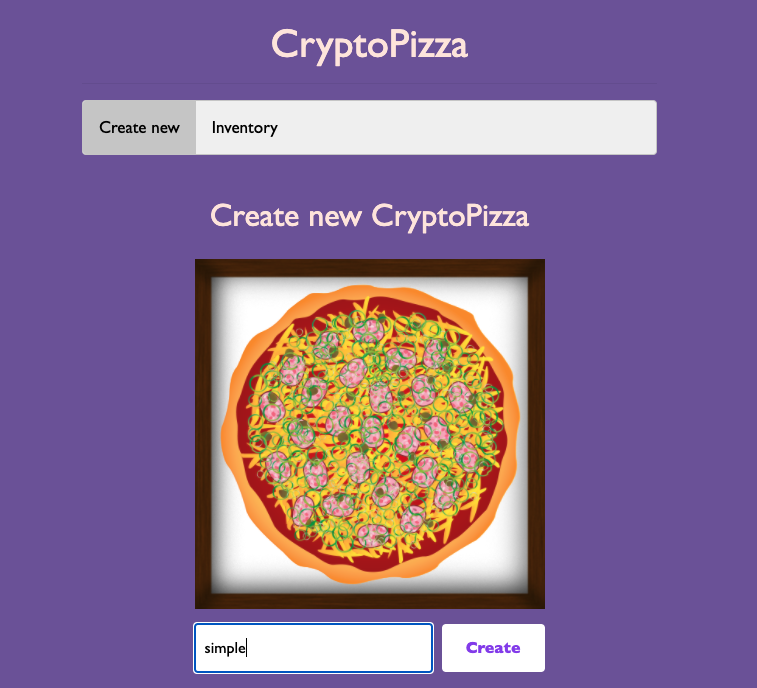
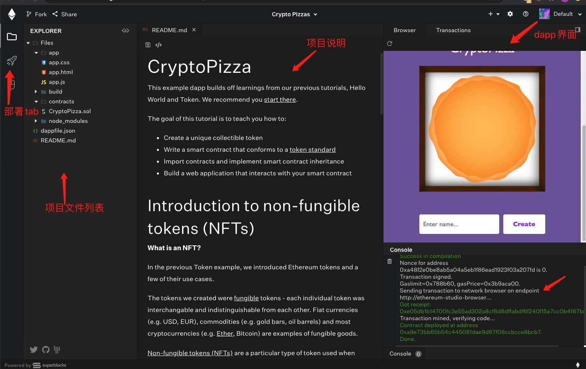

如何迁移以太坊 Dapp 到 Conflux 网络
===

Conflux 作为新一代完全去中心化，高性能公链，马上会迎来主网上线。除了性能比以太坊提高两个量级之外，其另外一大亮点是智能合约 VM 兼容 solidity。
也就是说一个以太坊的 Dapp 合约可以少量修改快速部署到 Conflux 主链上。开发者只需要将 web3.js 交互部分改用 js-conflux-sdk 实现即可。
本文将会演示如何将一个以太坊 Dapp 部署到 Conflux 网络上。

这里我们使用 [ethereum studio](https://studio.ethereum.org/) 提供的模板项目 CryptoPizza NFT 作为例子，尝试将他部署到 Conflux 网络。CryptoPizza 是一个链上 NFT （non-fungible tokens）合约，NFT 不同于 ERC20 所表示的货币，他的每个 token 通常用于表示一个唯一的实体，token 各不相同，一般用于表示实物财产或艺术品。
这里用于表示 Pizza，每个 Pizza 都不尽相同。该 Dapp 支持 Pizza 的 create, eat, gift 三种操作。其使用界面如下：




### 如何体验以太坊 CryptoPizza

打开 ethereum studio 选择创建 CryptoPizza 模板项目; 然后点击 `部署` 按钮即可在浏览器环境中部署该合约。
之后我们就可以在右侧渲染窗口体验 CryptoPizza 应用了。



1. 输入一个名字，然后点击 create 即可在链上创建一个 Pizza 。
2. 在 Inventory 页面可以查看自己的 Pizza，并执行 eat 和 gift 操作。

可以在[这里](https://studio.ethereum.org/5f4ca2dd26b4730012366595?hideExplorer=1)体验

### 迁移环境准备

1. 安装 Conflux 钱包(Portal), 创建账户并申领一笔 CFX（点击 Portal 的存入按钮，可以看到测试水龙头，领取代币）
2. Conflux 基本概念
3. 安装 `js-conflux-sdk`


#### Conflux Portal
Portal 是基于浏览器的 Conflux 插件轻量级钱包，基于不重复造轮子的想法，框架基于MetaMask改进而来，因此使用方法与 MetaMask 基本一致。Portal 负责管理 Conflux 的账户(私钥)，最核心功能是用私钥签名交易，并发送交易。
因此 Portal 是用户跟 Dapp 交互的钥匙媒介。Portal 的具体安装和使用方法参看[这里](https://juejin.im/post/6844904132948525070)


#### 基本概念

1. Epoch: 在比特币和以太坊中区块链都是链装结构，每个区块有一个递增的编号称为 block_number，在 conflux 中，其存储数据的账本结构是树图，无法给区块分配递增编号，但为了确定所有区块的全序，
定义了 Epoch 的概念，Epoch 序号单调递增，每个 Epoch 中可能会有多个 block，在 Epoch 内部 block 有其顺序(index)
2. StorageLimit: 在以太坊发送交易的时候有 gasLimit 的概念，用于限制一笔交易执行最大可以花费的金额，conflux 中不仅可以限制 gasLimit，还可以对交易的存储进行限制即 storageLimit (单位字节)
3. chainId: chainId 是用于防止交易重放的一个安全机制，发送交易时如果 chainId 不一致则不会成功。目前主网 ID 是 2，测试网是 1
4. RPC：主要用于从区块链获取数据，并发送交易，普通用户不需知道，但合约开发者需要了解，一般情况用户可以自己运行本地节点，使用本地节点的 RPC，这里我们使用主网的 RPC
5. CFX: conflux 网络的代币，用于支付交易的手续费，1CFX=10^8Gdrip=10^18drip 交易的发送 value 和 gas_price 单位均是 drip
6. 地址的区别：conflux 的普通账户的地址以 1 开头，合约地址以 8 开头，以太坊不做限制
7. receipt status: 在 conflux 中 receipt.outcomeStatus 表示交易的执行状态 0-成功，1-失败 跟以太坊相反


#### web3.js vs js-conflux-sdk
两者分别是以太坊和 Conflux 的 JavaScript SDK。主要功能均是提供了 RPC 调用的封装，Contract 交互封装，以及一些编解码，单位，类型转换等常用方法。
这里对两者的使用方法做一个简单对比

1. 安装方法: Node环境两者均使用 npm 安装

```sh
# web3
$ npm install web3
# js-conflux-sdk
$ npm install js-conflux-sdk@0.13.2
```

在浏览器环境: npm install 之后可以在 dist 目录找到对应的前端文件
```html
<!-- web3 -->
<script src="dist/web3.min.js"></script>
<!-- js-conflux-sdk -->
<script type="text/javascript" src="dist/js-conflux-sdk.umd.min.js">
```

2. 初始化(两者的默认端口不同)
```js
// web3
const Web3 = require('web3');  // 如果是浏览器环境，require 语句可以省略
let web3 = new Web3(Web3.givenProvider || "ws://localhost:8545");  // 这里使用 ws 链接，也可以使用 http 

// conflux
// initalize a Conflux object
const {Conflux} = require('js-conflux-sdk');
const cfx = new Conflux({
    url: 'http://localhost:12537',
    logger: console, // for debug
});
```

3. 调用 RPC 查询余额
```js
// web3
const balance = await web3.eth.getBalance('0x1bd9e9be525ab967e633bcdaeac8bd5723ed4d6b');
// conflux
const balance = await cfx.getBalance('0x1bd9e9be525ab967e633bcdaeac8bd5723ed4d6b');
```

conflux 方法调用非常简洁返回的是一个 promise，web3 则提供更复杂的功能：即支持promise，又支持callback

```js
// web3 promise vs callback
const balance = await web3.eth.getBalance('0x1bd9e9be525ab967e633bcdaeac8bd5723ed4d6b');

web3.eth.getBalance('0x1bd9e9be525ab967e633bcdaeac8bd5723ed4d6b', function(err, balance) {
    if (err) {
        console.log(err);
    } else {
        console.log(`balance is: ${balance}`);
    }
});
```

4. 发送交易

```js
// web3 使用 web3.eth.accounts.wallet 中的账户发送交易
let receipt = await web3.eth.sendTransaction({
    from: '0xde0B295669a9FD93d5F28D9Ec85E40f4cb697BAe',
    to: '0x11f4d0A3c12e86B4b5F39B213F7E19D048276DAe',
    value: '1000000000000000'
});
// conflux
let account = conflux.Account("your_private_key");
const txHash = await cfx.sendTransaction({
    from: account, // from account instance and will by sign by account.privateKey
    to: "0x-another-address", // accept address string or account instance
    value: util.unit.fromCFXToDrip(0.125), // use unit to transfer from CFX to Drip
});
```

5. 在区块链系统中，交易的完成是分多个阶段：发送，打包，执行，确认。对应不同阶段的获取方式两个sdk不尽相同。

```js
// web3 使用事件的方式
web3.eth.sendTransaction({from: '0x123...', data: '0x432...'})
    .once('sending', function(payload){ ... })
    .once('sent', function(payload){ ... })
    .once('transactionHash', function(hash){ ... })
    .once('receipt', function(receipt){ ... })
    .on('confirmation', function(confNumber, receipt, latestBlockHash){ ... })
    .on('error', function(error){ ... })
    .then(function(receipt){
        // will be fired once the receipt is mined
    });

// conflux 提供了不同的方法，可以获取 tx 不同阶段的信息
let txParameters = {
  from: account,
  to: "0x-a-address",
  value: "0x100"
};
const txHash = await cfx.sendTransaction(txParameters);  // send the tx and return a hash
const tx = await cfx.sendTransaction(txParameters).get();  // will also get the tx by hash
const tx = await cfx.sendTransaction(txParameters).mined();  // wait tx mined and return the tx
const receipt = await cfx.sendTransaction(txParameters).executed();  // wait tx executed and return receipt
const receipt = await cfx.sendTransaction(txParameters).confirmed();  // wait tx confirmed and return receipt
```

6. contract 实例化 & 方法调用

```js
// web3
var Contract = require('web3-eth-contract');
// set provider for all later instances to use
Contract.setProvider('ws://localhost:8546');

var contract = new Contract(jsonInterface, address);
myContract.methods.myMethod(123).call({from: 'address'}, function(error, result){
});
// or sending and using a promise
myContract.methods.myMethod(123).send({from: 'address'})
.then(function(receipt){
});

// js-conflux-sdk
let contract = cfx.Contract({
    abi: this.Contract.abi,
    address: this.Contract.address,
});
await contract.myMethod(123);
await contract.myMethod(123).sendTransaction({from: "addres"});
```

### 将合约部署到 Conflux 网络

准备工作铺垫完之后，可以开始迁移了。在 File Exporler 有下载 Zip 包的功能，下载的时候注意一块下载 abi, bytecode。
导出的文件目录如下：
1. app: html 页面代码
2. build：合约编译后文件
3. contracts：合约源代码
4. node_modules：nodejs 模块代码

下载完之后的第一件事是安装 `js-conflux-sdk`。然后我们就可以编写脚本以发送 TX 的方式部署合约。

```js
const privateKey = "0xxxxxx";
const fs = require('fs');
const account = cfx.Account(privateKey); // create account instance

async function main() {
    let abi = JSON.parse(fs.readFileSync('./build/contracts/CryptoPizza/CryptoPizza.abi'));
    let bytecode = fs.readFileSync('./build/contracts/CryptoPizza/CryptoPizza.bin');
    const contract = cfx.Contract({
        abi,
        bytecode,
    });
    
    // deploy the contract, and get `contractCreated`
    const receipt = await contract.constructor()
        .sendTransaction({ from: account })
        .confirmed();
    console.log(receipt); // 最终部署的合约地址是： receipt.contractCreated: 
}

main().catch(e => console.error(e));
```

注：部署时需要一个有余额的账户，并需要导出其私钥


### Dapp 前端交互部分迁移

App 目录中的 index.html 是网页文件。首先我们需要将 app.css, app.js 还有 js-conflux-sdk 的 js 代码引入进来。
另外还需要将合约的 abi 以js 变量的形式引入。

然后主要的迁移工作量将集中在 app.js 中，因为我们需要将 web3.js 相关代码替换为 js-conflux-sdk。并且为了实现使用 portal 账户创建 Pizza 的功能，
还需要集成 Portal 的 API。

#### 连接 portal
因为创建 Pizza 需要发送交易，所以需要连接 conflux portal，从而可以获取账户地址，发起交易，签名并发送。
具体的使用方法参看[文档](), 我这里需要做的是初次打开页面的时候获取授权连接，然后将 `conflux` 设置为 sdk 的provider，并且在发送交易的时候使用 portal 的 account。

```js
// 1. 添加一个按钮并在点击的时候，连接 portal
$(document).on('click', 'button.connect-portal', async function() {
    const accounts = await conflux.enable();
    console.log('connected to portal');
});

// 2. 设置provider
this.web3.provider = conflux;

// 3. 使用conflux.selectedAddress 获取当前选中的账户地址
conflux.selectedAddress
```

#### conflux 实例初始化 

```js
var Contracts = {};
// 设置合约的地址和 abi
Contracts['CryptoPizza'] = {
    abi: contract_abi,
    address: "0x8b0d9204db0adf41aa49e3fe43e20447555c28a3",  // this is the address of newly deployed contract
    endpoint: "http://mainnet-jsonrpc.conflux-chain.org:12537"
};

// below code is in Pizza.prototype.init
this.web3 = new window.Conflux.Conflux({
    url: this.Contract.endpoint,
    logger: console,
});

if (conflux.isConnected()) {
    this.web3.provider = conflux;  // 使用 portal 提供的 conflux 对象，作为sdk 的provider
}

this.instance = this.web3.Contract({
    abi: this.Contract.abi,
    address: this.Contract.address,
});
```

#### 合约 getter 方法修改
涉及到的方法包括：getRandomDna，getPizzasByOwner，waitForReceipt

```js
// 原始代码中使用 web3 的 callback 的方式获取数据，需要替换成 js 的 promise 方式
Pizza.prototype.getRandomDna = function(name, address, cb) {
    this.instance.generateRandomDna(name, address, function(error, result) {
        cb(error, result);
    });
};

// 替换为
Pizza.prototype.getRandomDna = function(name, address, cb) {
    // conflux-sdk 返回一个 promise，其 then 方法接受两个 callback 方法
    this.instance.generateRandomDna(name, address)
        .then(
            function(result) {
                cb(null, result[0]);  // why return a array?
            }, function(err) {
                cb(err);
            }
        );
};
```


#### 合约状态修改方法调整
合约状态的修改需要通过发送交易的方式调用合约方法并设置状态。两者的主要区别在于设置 tx 参数及返回数据的方式不同。
```js
// 原始调用方式
this.instance.createRandomPizza(
        name,
        {
            from: window.web3.eth.accounts[0],
            gas: 1000000,
            gasPrice: 1000000000,
            gasLimit: 1000000
        },
        cbk
)
// 替换为
this.instance
        .createRandomPizza(name)
        .sendTransaction({
            from: conflux.selectedAddress
        }).then(success_cbk, fail_cbk)
```

涉及到的方法包括：createRandomPizza， giftPizza， eatPizza


这些修改完之后我们就完成了 Dapp 交互部分代码的迁移工作。

最后如果你想体验这个 Dapp 的话，可以来[这里](http://pana.wang/crypto_pizza/), 前提需要先装好 Portal 哟.

#### 其他

1. 本文使用的 js-conflux-sdk 版本为 0.13.2
2. Pizza 列表页的数据加载时机改为了在 tab 切换时加载


### 参考

1. [js-conflux-sdk](https://github.com/conflux-chain/js-conflux-sdk)
2. [conflux portal](https://developer.conflux-chain.org/docs/conflux-portal/docs/en/portal/introduction)
3. [ethereum studio](https://studio.ethereum.org/)
4. [文章示例代码](https://github.com/Pana/crypto_pizza)


