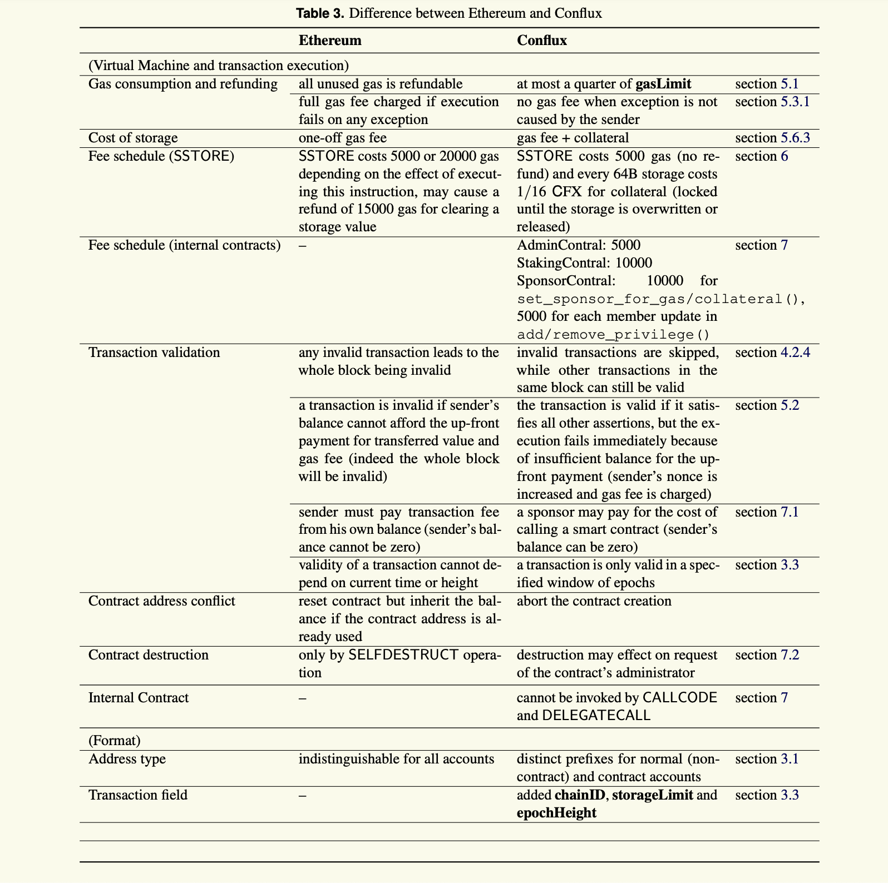

Conflux 和 以太坊的区别
===
众所周知以太坊是目前最成功的区块链 2.0 平台，公认的世界计算机。吸引了全球的区块链开发者在其上开发应用，并建立了强大的金融，游戏生态。
但以太坊的 TPS 虽然比比特币略快，但仍然远远无法满足普通大众的使用需求。所以才有了 EOS，Tron 等标榜区块链 3.0 的平台。
但 DPOS 共识协议远远牺牲了区块链平台的去中心化程度。
Conflux 作为新一代平台中的知名项目，使用独特的 TreeGraph 账本结构和 GHAST 共识协议，能够将 TPS 提升至 3000-60000，并且仍然是完全去中心化的。
Conflux 的智能合约虚拟机几乎完全兼容 EVM，使得大部分 Solidity 智能合约可以直接部署到 Conflux 网络中。
但因为底层账本结构的巨大差异，智能合约开发过程中还是有一些差异，本文对这些差异做一些简单总结，希望在小伙伴们开发 Conflux 智能合约过程中会有帮助。

### EpochNumber vs BlockNumber

solidity global variable: block.number

### 出块时间
以太坊的出块时间是 10s 左右，conflux 是 0.5s

### storageLimit

### 代付费机制

###  Checklist for porting EVM contract to Conflux

1. Gas used and refund: Conflux 在 SSTORE 操作中需要更少的 gas, 但是在 storage 清空或 contract 销毁的时候不会返还 gas
2. Gas fee refund: Conflux 最多会返回 gas limit 的 1/4 ，所以在签署交易之前，提供一个更准确的 gas estimation
3. Contract address: Conflux 的普通账号地址和合约地址的计算方式不同
4. Contract address conflict: 如果创建合约时，计算出的地址已经有合约存在，则会放弃创建合约（不会重试）
5. Collateral for storage: Conflux 的存储需要抵押，所以请确保足够的余额用于抵押。

### 账户地址

在以太坊中普通账户地址和合约地址没有区别，在 conflux 则有不同的前缀。

## Transaction field

Conflux 添加了几个字段： chainId, epochHeight, storageLimit
使用 epochNumber 替换了 number

### 参考

* [Here are opcodes that are missing in Conflux VM](https://github.com/Conflux-Chain/conflux-rust/issues/1442)