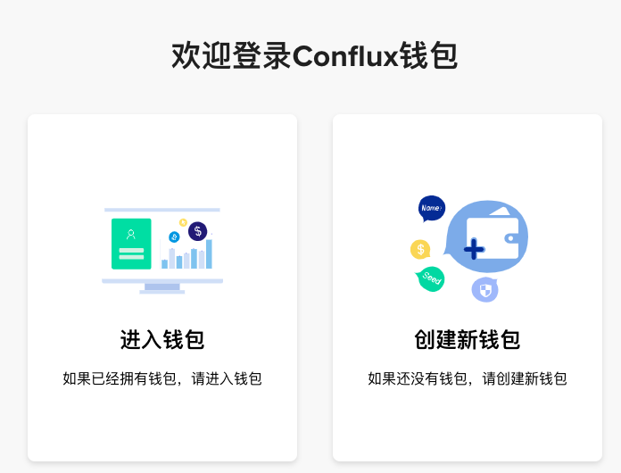
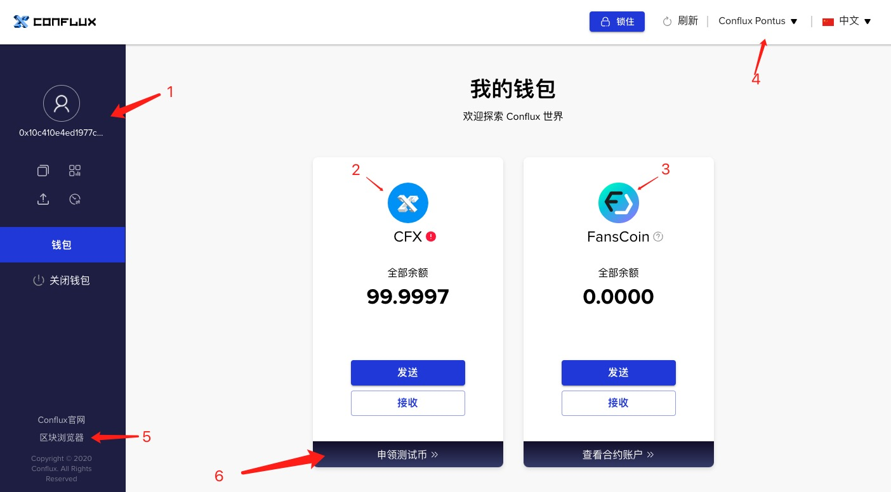

Conflux 智能合约开发体验
===


[Conflux](https://confluxnetwork.org/) 是新一代高性能公链，基于自研的TreeGraph账本结构和GHAST共识协议，能够在完全去中心化的前提下，实现3000+TPS的吞吐率。
并且其智能合约VM，可以完全兼容EVM智能合约，意味着以太坊的智能合约可以不用改动直接部署到Conflux区块链上。
目前Conflux主网正在分阶段（共三阶段）上线，计划年内完成正式发布。目前处于第一阶段(Pontus), 小伙伴们可以提前体验Conflux 飞一般的速度。

* [创建账号](#创建Conflux区块链账号)
* [运行本地节点](运行本地节点)
* [开发&编译智能合约]()
* [部署]()
* [智能合约交互]()
* [参考](参考资料)

## 创建Conflux区块链账号
体验任何区块链系统，获取账号（地址）是第一步，账号是进入区块链世界的门票或钥匙。运行全节点挖矿，部署智能合约，获取发送数字货币均需要账号。
区块链钱包软件都提供创建账号的功能，目前Conflux提供了两款钱包 Conflux Portal 和 Web wallet。


#### Conflux Portal
[Conflux Portal](https://portal.conflux-chain.org/) 是一个浏览器扩展程序，需要到浏览器扩展市场安装。Portal 是在 MetaMask 基础之上修改，并适配Conflux网络的，主要提供账号创建，恢复，收发代币，查看交易，切换不同网络等功能。


#### (Web) Conflux Wallet
Conflux 官方的另外一个钱包是 Web 版的 wallet，不需要安装，直接通过[网址](https://wallet.confluxscan.io/login)访问。在浏览器中打开 web 版wallet后，可以看到两个选项: 进入钱包，创建新钱包。



1. 新用户首次进来只能进行创建新钱包操作，钱包创建首先需要设置密码，设置完成之后，会提供 keystore 下载链接，点击下载到本地。
2. 老用户可选择进入钱包，第一步会提示上传 keystore 文件，然后输入密码，成功之后会进入web wallet 的主页面。



该页面主要提供的功能有：
1. 账户地址（可点击复制或查看二维码），另外下边提供了私钥查看的图标
2. CFX资产管理功能，可查看余额，收发CFX
3. FansCoin（社区币）管理功能
4. 网络切换（web wallet 目前只支持Potus主网）
5. Conflux浏览器链接
6. Potus 代币申领链接，每小时可领一次（并非真CFX，之后主网重启，该代币失效）

需要注意的地方：
1. 创建账号的密码和keystore文件一定要妥善保管，有这两者才能进入钱包，如果被别人获取会造成资产被盗
2. 账号的私钥非常重要，也不能随意泄露
3. 私钥和keystore均在浏览器本地，不会上传到 Conflux 服务器。


通过web wallet 和conflux portal均可以创建账号，获取地址和私钥, 地址通常以 0x开头，例如 ```0x10c410e4ed1977cf7f963cdcc8888e65e2d8a9a4```,
账号和私钥在部署合约的时候都会用到。


## 运行本地节点
Conflux Pontus目前运行的是 Rust 开发的 Conflux [协议实现](https://github.com/Conflux-Chain/conflux-rust)，运行本地节点可以直接下载编译好的节点程序或
下载源码本地编译。为了完整体验，这里采用的


### 参考资料

1. [Conflux doc](https://developer.conflux-chain.org/)