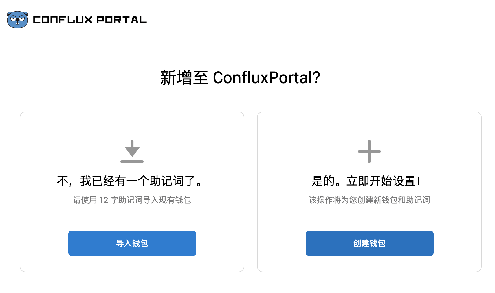
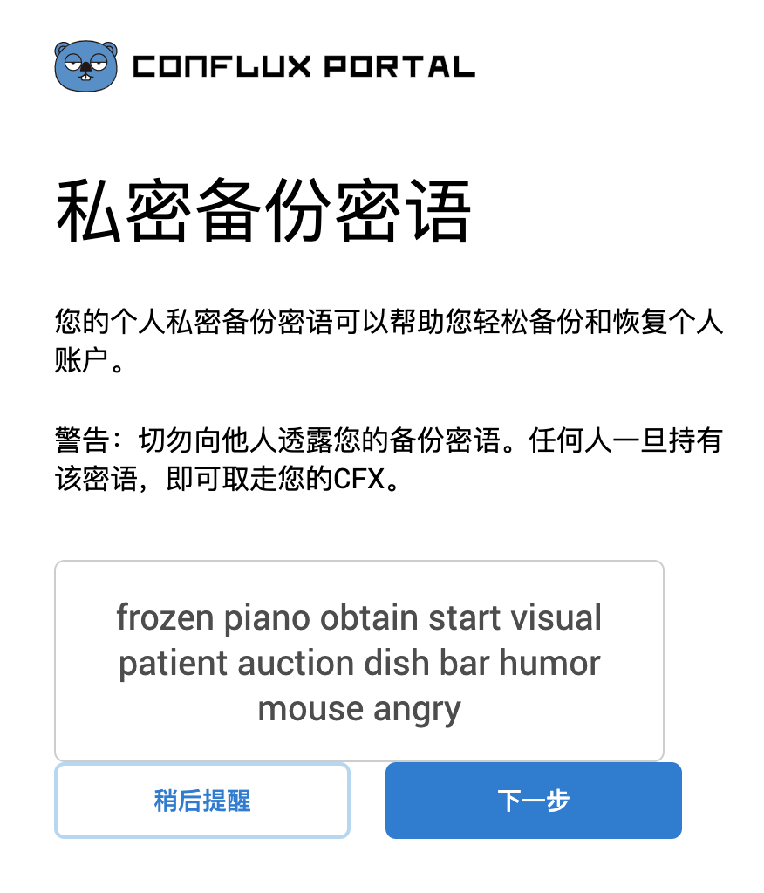
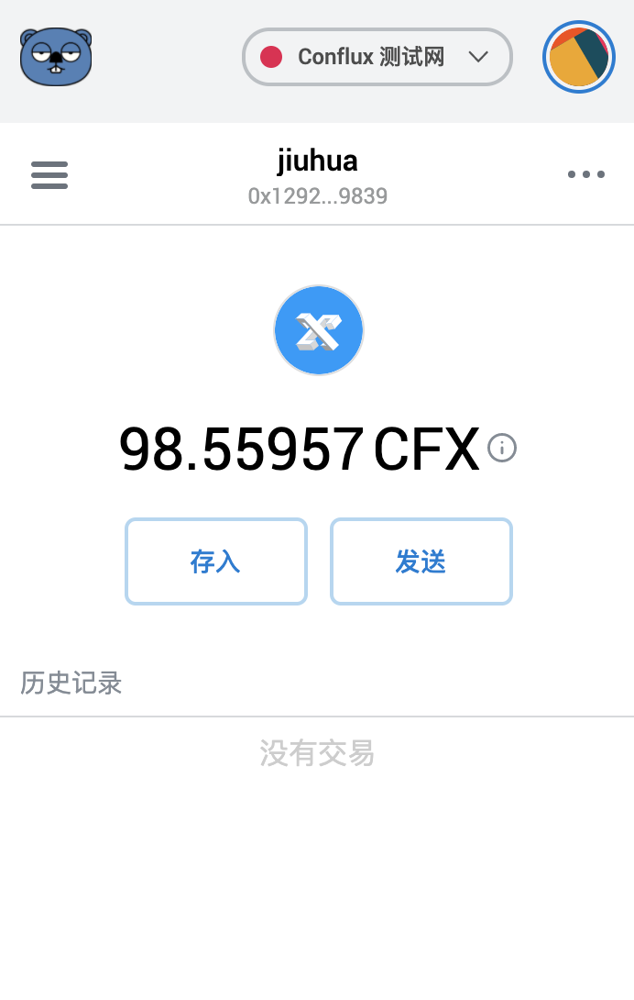
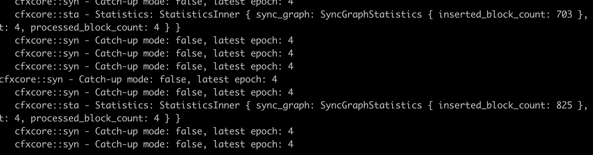
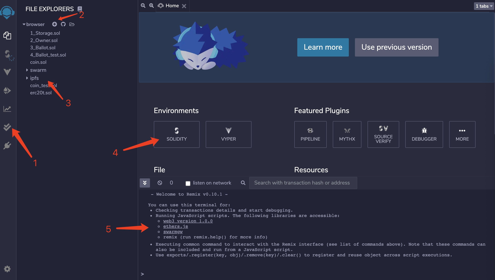
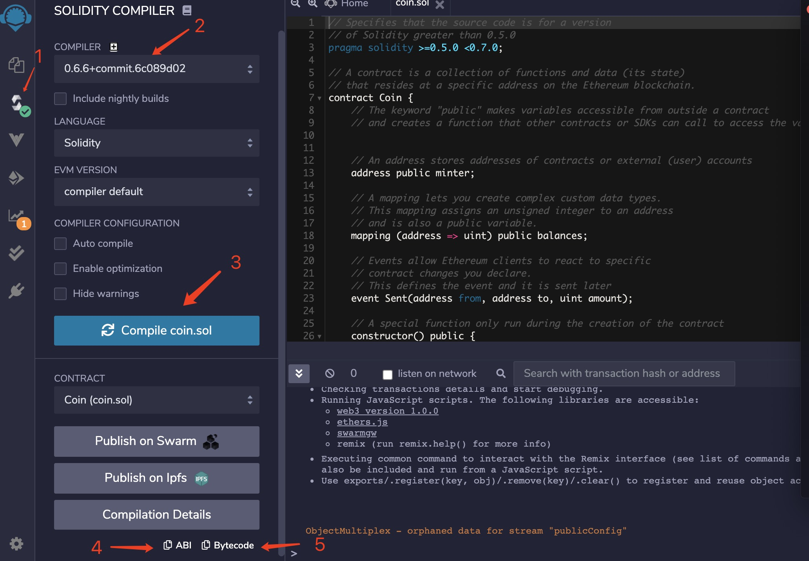

Conflux 智能合约开发体验
===


[Conflux](https://confluxnetwork.org/) 是新一代高性能公链，基于自研的TreeGraph账本结构和GHAST共识协议，能够在完全去中心化的前提下，实现3000+TPS的吞吐率。
并且其智能合约VM，可以完全兼容EVM，意味着以太坊的智能合约可以不用改动直接部署到Conflux区块链上。
目前Conflux主网正在分阶段（共三阶段）上线，计划年内完成正式发布。目前处于第一阶段(Pontus), 小伙伴们可以提前体验Conflux 飞一般的速度。
这里把在Conflux上部署智能合约的过程和体验做了一个简单记录。

* [创建账号](#创建Conflux区块链账号)
* [运行本地节点](#运行本地节点)
* [js-sdk发送交易](#使用js-conflux-sdk发送交易)
* [开发&编译智能合约](#开发编译智能合约)
* [部署](#合约部署)
* [智能合约交互](#智能合约交互)
* [参考](#参考资料)

## 创建Conflux区块链账号
体验任何区块链系统，获取账号（地址）是第一步，账号是进入区块链世界的门票或钥匙。运行全节点挖矿，部署智能合约，获取发送数字货币均需要账号。
区块链钱包软件都有创建账号的功能，目前 Conflux 官方提供了两款钱包 Conflux Portal 和 Web wallet。


### Conflux Portal
[Conflux Portal](https://portal.conflux-chain.org/) 是一个浏览器扩展程序，需要到浏览器扩展市场安装。Portal 是在 MetaMask 基础之上修改，并适配Conflux网络的，其主要功能和使用方式跟 MetaMask 基本一致。

安装完之后，首次进入会看到两个选项：创建新钱包或通过助记词导入（12 随机单词，用于备份账户）。如果选择创建新钱包，会随机生成新的助记词，你需要保存下来，并记好，因为下步会进行确认，而且助记词也是恢复和迁移钱包的唯一方式。



进行助记词确认，确认之后会需要设置一个密码，portal 会不定期锁定，之后进入需要输入密码。



一切设置完成之后你就有一个protal 钱包了，里面可以创建多个账户，查看地址私钥，收发CFX。



需要注意的几点：

1. 助记词非常关键，要保存好。
2. 存入按钮里面有 faucet功能，可以申领测试代币。
3. 账户详情里面可以查看私钥。


### (Web) Conflux Wallet
Conflux 官方的另外一个钱包是 Web 版的 wallet，不需要安装，直接通过[网址](https://wallet.confluxscan.io/login)访问。在浏览器中打开 web 版 wallet 后，可以看到两个选项: 进入钱包，创建新钱包。


1. 新用户首次进来只能进行创建新钱包操作，钱包创建首先需要设置密码，设置完成之后，会提供 keystore 下载链接，点击下载到本地。
2. 老用户可选择进入钱包，第一步会提示上传 keystore 文件，然后输入密码，成功之后会进入web wallet 的主页面。


该页面主要提供的功能有：
1. 账户地址（可点击复制或查看二维码），下边提供了私钥查看的图标
2. CFX资产管理功能，可查看余额，收发CFX
3. FansCoin（社区币）管理功能
4. 网络切换（web wallet 目前只支持Pontus主网）
5. Conflux 浏览器链接
6. Pontus 代币申领链接，每小时可领一次（临时主网CFX，之后主网重启，该代币失效）

需要注意的地方：
1. 创建账号的密码和keystore文件一定要妥善保管，有这两者才能进入钱包，如果被别人获取会造成资产被盗
2. 账号的私钥非常重要，不能随意泄露
3. 私钥和 keystore 均在浏览器本地，不会上传到 Conflux 服务器。


通过 web wallet 和 conflux portal均可以创建账号，获取地址和私钥, 地址通常以 0x开头，例如 ```0x10c410e4ed1977cf7f963cdcc8888e65e2d8a9a4```,
账号和私钥在部署合约的时候都会用到。


## 运行本地节点
Pontus 目前运行的是 Rust 开发的 Conflux [协议实现](https://github.com/Conflux-Chain/conflux-rust)，运行本地节点可以直接下载编译好的节点程序或
下载源码本地编译。为了完整体验，这里采用下载源码进行编译的方式。（编译环境为 OSX）。

### 准备编译环境
编译前需要先准备环境，安装必须的软件：Rust, cmake, clang 等

1. 在 OSX 中开发，先安装 xcode command line 一定没错，可以直接在App store安装Xcode（包含command line 工具），或直接在终端执行命令```xcode-select --install```安装 (具体安装步骤可自行Google)
2. 通过 rustup 安装 Rust 语言环境 
    ```sh
    $ curl --proto '=https' --tlsv1.2 -sSf https://sh.rustup.rs | sh
    ```
3. 安装brew （OSX 下的包管理软件-神器）
    ```sh
    $ /bin/bash -c "$(curl -fsSL https://raw.githubusercontent.com/Homebrew/install/master/install.sh)"
    ```
4. 安装 cmake (conflux-rust 编译回用到） ```brew install cmake```
5. clang (xcode command line 包含，不需要单独安装，当然可以通过brew 安装 ```brew install llvm```)

其他操作系统的环境准备方式可以参看官方的[文档](https://developer.conflux-chain.org/docs/conflux-doc/docs/installation)

### 编译代码
Conflux 是开源项目，代码在 Github 上开源，可通过 Git clone 到本地，然后进行编译。

```sh
# download Conflux code
$ git clone https://github.com/Conflux-Chain/conflux-rust
$ cd conflux-rust
$ git checkout v0.5.0.4
# build in release mode
$ cargo build --release
```

目前的 conflux-rust 的版本号是 0.5.0.4 clone 代码和编译的过程时间比较长，需要耐心等待🤓（跟据网络情况，不一而同）。
编译结束之后，会创建一个新的文件夹 target/release，里面包含一个 conflux 可执行文件，即是我们最终要运行的本地节点程序了。

### 运行本地节点
运行节点我们需要有一个配置文件，在代码 run 目录下的 default.toml (toml格式文件) 是配置文件模板，我们只需要简单配置几项即可用于运行节点。

1. ```public_address="124.193.101.50:32323"``` 节点对外的地址，由IP（公网IP，可以通过Google或百度搜索IP获得）和端口号（默认32323）组成
2. ```mining_author=1386b4185a223ef49592233b69291bbe5a80c527``` 挖矿奖励目标账号，之前创建的账号可以填到这里（注意去掉地址前边的0x，不然启动会报错）
3. ```bootnodes``` 此项是用于同步数据的启动节点地址配置，版本 0.5.0.4 默认配置的是主网 Pontus 的节点，可以不用修改
4. ```start_mining=true``` 如果想开启挖矿，打开注释，并设置为true 
5. ```jsonrpc_local_http_port=12539``` 本地 rpc 端口配置，打开注释，即可访问本地rpc服务

设置好之后，就可以启动节点了
```sh
$ cd run
$ ../target/release/conflux --config default.toml
```

如果一切正常的话，程序会尝试连接网络中的其他节点，并开始同步区块数据，你会看到 latest_epoch 数字，不停增长，追赶主网。




## 使用js-conflux-sdk发送交易
Conflux 不仅提供标准的 JSON-RPC 2.0 接口用于跟链进行交互，同时也提供了多个语言的SDK，方便快速开发和集成，包括JavaScript，Java，Go等。其中 JS 版功能最完善。
如果你进行过以太坊智能合约开发，可以把它理解成 web3.js。这里我们尝试用它发送一笔 CFX 转账（Node.js 环境）。首先使用 npm 安装。

```npm install js-conflux-sdk```

安装完成之后，我们就可以用它发送一笔 CFX 交易了，具体代码如下：

```js
// sendTx.js
const { Conflux, util } = require('js-conflux-sdk');

async function main() {
  const TestNetUrl = 'http://testnet-jsonrpc.conflux-chain.org:12537';
  // initiate a Conflux object
  const cfx = new Conflux({
    url: TestNetUrl,
    defaultGasPrice: 100, // The default gas price of your following transactions
    defaultGas: 1000000, // The default gas of your following transactions
    logger: console,
  });

  // account private key
  const PRIVATE_KEY = '0xxxxxxxxxxxx';  // replace your private key here, add 0x prefix
  const account = cfx.Account(PRIVATE_KEY); // create account instance
  const receiver = '0x13d2bA4eD43542e7c54fbB6c5fCCb9f269C1f94C';
  // transaction parameters
  let txParams = {
      from: account, // from account instance and will by sign by account.privateKey
      to: receiver, // accept address string or account instance
      value: util.unit.fromCFXToDrip(0.125), // use unit to transfer from 0.125 CFX to Drip
  };
  // send transaction
  const txHash = await cfx.sendTransaction(txParams);
  console.log(txHash);
}
  
main().catch(e => console.error(e));
```
在终端运行以上脚本即可完成一笔转账，最后会输出一个交易 hash，你可以到 confluxscan 查询该交易的详细信息。

需要注意的几个地方：

1. 示例中使用的是Conflux Testnet 的 rpc 服务
2. 私钥需要以 0x 开头，从钱包中获取到的私钥是不包含 0x 的
3. 示例代码可以在 node.js 环境中运行，具体参看 sendTx.js
4. 具体使用方法参看[官方文档](https://developer.conflux-chain.org/docs/conflux-doc/docs/send_transaction)和[源码](https://github.com/Conflux-Chain/js-conflux-sdk)

## 开发编译智能合约
Conflux 几乎完全兼容以太坊智能合约，以太坊的智能合约通常情况可以不经修改直接部署到 Conflux 网络，本文主要演示 Conflux 的 Dapp 部署过程和方式，关于智能合约的开发和文档可以查看以太坊相关文档。

### Coin 智能合约
```Coin``` 是一个简单的 solidity 智能合约。具备代币的基本功能：

1. mint: 铸造新币 (只有合约发布者可以 mint)
2. balances: 查询余额
3. send: 转账

具体代码如下：

```js
pragma solidity >=0.5.0 <0.7.0;

contract Coin {
    address public minter;
    mapping (address => uint) public balances;

    event Sent(address from, address to, uint amount);

    constructor() public {
        minter = msg.sender;
    }

    function mint(address receiver, uint amount) public {
        require(msg.sender == minter);
        require(amount < 1e60);
        balances[receiver] += amount;
    }

    function send(address receiver, uint amount) public {
        require(amount <= balances[msg.sender], "Insufficient balance.");
        balances[msg.sender] -= amount;
        balances[receiver] += amount;
        emit Sent(msg.sender, receiver, amount);
    }
}
```

Solidity 是智能合约开发的高级语言，不能直接部署，需要使用编译器，编译为 bytecode。以太坊社区开发工具众多，原生 solc(c++) 编译器， remix，truffle， Ethereum studio 均可用来编译，下边我们会使用知名的 Remix 在线 IDE 来编译 Coin 合约。

### 使用 Remix 编译
[Remix](https://remix.ethereum.org/)是一个以太坊智能合约在线IDE，提供智能合约开发，测试，编译，部署等功能，本文使用 Remix 来编译 coin 智能合约。
打开 remix 网址之后我们会看到如下界面



1. Icon panel 可以在这里进行编辑，编译等主功能切换
2. Side panel 点击加号可以添加文件，然后把我们的 coin.sol 代码复制进来
3. 具体的文件列表
4. Remix支持 solidity 和 vyper 两种合约开发语言，我们这里先选择 solidity 环境（重要）
5. 控制台：会显示编译，部署等日志信息，调试的时候回非常有用。

文件创建好，并把coin合约代码复制进来之后，我们就可以进行编译了



1. 首先在Icon panel选择第二项，编译功能
2. 可以切换不同版本的编译器，这里直接使用默认版本
3. 点击compile coin.sol 进行编译（需要先选中 coin.sol）
4. 编译成功之后可以看到 abi 和 bytecode 的下载按钮，需要把两个下来下来保存到本地文件中。

至此我们使用 Remix 编译了 Coin 合约，拿到了 abi 和 bytecode，这两个是我们部署合约时会用到的原料。
其实它的功能非常强大，有兴趣的小伙伴可以自己探索。

## 合约部署
合约编译好，终于可以进行部署操作了，如果前几步你都操作成功的话，你现在应该有一个Conflux 的账号和私钥，通过Facuet 领取了一些CFX币，有智能合约的 abi 和 bytecode。
并且你还会使用 js-conflux-sdk, 好我们现在来将合约部署到conflux网络。合约部署本质也是发送了一笔 transaction，只是会附带上合约的 abi 和 bytecode。
下边是一个使用 js sdk 部署合约的脚本：

```js
const { Conflux } = require('js-conflux-sdk');
const MAIN_PRIVATE_KEY = '0xxxxxxxxxx';
const testNetUrl = 'http://testnet-jsonrpc.conflux-chain.org:12537'

async function main() {
  const cfx = new Conflux({
    url: testNetUrl,
    defaultGasPrice: 100,
    defaultGas: 1000000,
    logger: console,
  });

  const account = cfx.Account(MAIN_PRIVATE_KEY); // create account instance
  console.log(account.address);

  // ================================ Contract ================================
  // create contract instance
  const contract = cfx.Contract({
    abi: require('./contracts/coin.abi.json'),
    bytecode: require('./contracts/coin.bin.json'),
  });

  // deploy the contract, and get `contractCreated`
  const receipt = await contract.constructor()
    .sendTransaction({ from: account })
    .confirmed();
  console.log(receipt); 
}

main().catch(e => console.error(e));
```
设置好私钥，通过 node 执行该脚本，即可完成智能合约的部署。

需要注意的几点：
1. coin.bin.json 文件中包含从 Remix 复制出来的 bytecode 数据的 object 信息，并且需要添加 0x 前缀，并用双引号引起来才能通过require的方式加载进来 （或者直接将object 放到代码中也可以）
2. confirmed() 方式调用会定时请求 conflux 网络，直到交易被确认。
3. 合约创建成功后 receipt 中会包含交易的 hash，合约的地址等信息，可以到 confluxscan 中查看详情。
4. 也可以使用 confluxscan 的[合约部署页面](http://www.confluxscan.io/contract/create)进行部署

## 智能合约交互
智能合约部署完成之后我们就大功告成了，现在让我们来玩一玩我们的合约吧，跟合约交互主要分为两种：获取合约状态（获取余额）；更改合约状态（转账交易）。前者不会消耗代币，直接调用即可，并且可以直接返回结果；改变合约状态则需要通过发送交易的方式触发，需要花费一些代币，并且是异步完成的，不会立刻得到结果，只能得到一个交易的hash。以下脚本演示了如何进行这两种合约交互。

```js
// invoke-contract.js
const { Conflux, util } = require('js-conflux-sdk');

async function main() {
const PRIVATE_KEY = '0xxxxxxx';
  const cfx = new Conflux({
    url: 'http://testnet-jsonrpc.conflux-chain.org:12537',
    defaultGasPrice: 100,
    defaultGas: 1000000,
    logger: console,
  });

  const account = cfx.Account(PRIVATE_KEY); // create account instance

  const contractAddress = '0x8a43514200778e9ff023039b55ca3192064f8e44';
  const contract = cfx.Contract({
    abi: require('./contracts/coin.abi.json'),
    address: contractAddress,
  });

  let address = '0x1386B4185A223EF49592233b69291bbe5a80C527';

  let ret;
  // mint 100 to address, need send a transaction
  ret = await contract.mint(address, 100).sendTransaction({
      from: account,
  }).confirmed();
  console.log(ret.toString());

  // get balance of address
  ret = await contract.balances(address); 
  console.log(ret.toString());
}

main().catch(e => console.error(e));
```

## 总结
因为conflux主网刚刚上线，相关文档还在不断完善当中，所以这里把整个的操作过程展示了一下，conflux 能够很好的兼容以太坊智能合约，所以合约的开发和编译生态可以直接复用以太坊
，既不同学习新的合约开发语言，相关的工具也能拿来直接用。整个体验过程中conflux交易速度的确比以太坊快很多，还是相当令人惊艳。希望 conflux 的开发生态和用户能够很快繁荣起来。

## 参考资料

1. [Conflux doc](https://developer.conflux-chain.org/)
2. [Conflux 区块浏览器 confluxscan](http://www.confluxscan.io/)